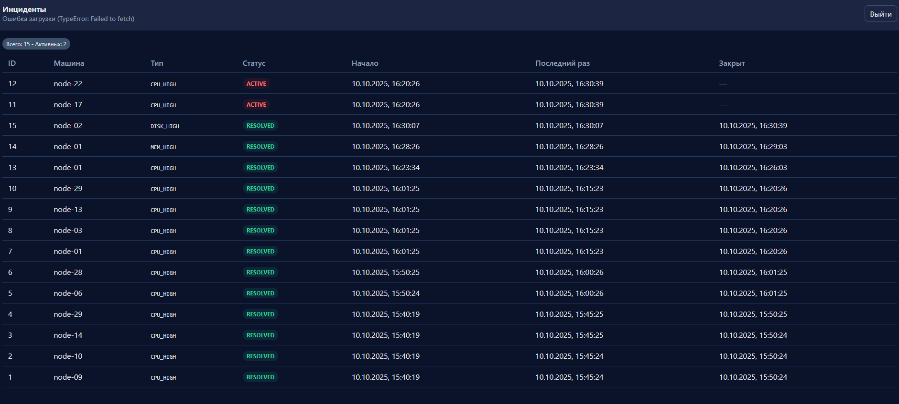

# 🖥️ Resource Monitoring System

Система мониторинга ресурсов с автоматическим сбором метрик, фиксацией инцидентов и веб-интерфейсом отображения.  
Проект реализован в рамках тестового задания.

---

## 🚀 Стек технологий

- **Backend:** Python 3.12, Django 5  
- **Database:** MySQL 8  
- **Broker:** Redis 7  
- **Async tasks:** Celery + Celery Beat  
- **Frontend:** HTML + Vanilla JavaScript (без фреймворков)  
- **Docker Compose:** для запуска инфраструктуры  
- **Auth:** собственный middleware без использования стандартной Django-аутентификации  

---

## ⚙️ Архитектура

```text
Django (monitor_site)
├── monitoring/
│   ├── models.py           # Machine, Metric, Incident
│   ├── tasks.py            # Сбор метрик и анализ инцидентов
│   ├── middleware.py       # Кастомная аутентификация
│   ├── views.py            # API + web-интерфейс
│   ├── templates/
│   │   ├── login.html
│   │   └── incidents.html
│   └── urls.py
├── celery.py               # Настройка Celery и Beat
├── settings.py             # БД, Redis, расписания задач
├── docker-compose.yml      # MySQL + Redis + Django
└── README.md
```

---

## 🧩 Задачи проекта

### **Задача 1 — Сбор данных**
Фоновый опрос 30 удалённых машин каждые 15 минут.  
Каждая машина отвечает JSON-метрикой:
```json
{
  "cpu": 60,
  "mem": "30%",
  "disk": "43%",
  "uptime": "1d 2h 37m 6s"
}
```
✅ Реализовано:
- Периодический сбор через Celery Beat (`fetch-every-15-min`)  
- Сохранение метрик в БД  
- Масштабируемая архитектура (воркеры можно горизонтально масштабировать)  

---

### **Задача 2 — Мониторинг и фиксация инцидентов**
На основе собранных метрик система выявляет инциденты по порогам:

| Параметр | Порог | Условие фиксации | Статус |
|-----------|--------|-----------------|--------|
| CPU | > 85% | одномоментно | ✅ |
| MEM | > 90% | в течение 30 минут | ✅ |
| DISK | > 95% | в течение 2 часов | ✅ |

✅ Реализовано:
- Создание инцидента при превышении  
- Недублирование активных инцидентов  
- Авто-закрытие после нормализации значений  
- Полная проверка логики вручную через shell  

---

### **Задача 3 — Веб-интерфейс**
Интерфейс для отображения зафиксированных инцидентов.

✅ Реализовано:
- Чистый **vanilla JS** (без фреймворков)  
- Автоматическое обновление данных каждые 10 секунд  
- Кастомная авторизация через `SimpleAuthMiddleware`  
- Таблица с активными и закрытыми инцидентами  
- Цветовое различие статусов (ACTIVE / RESOLVED)  

---

## 📸 Скриншот интерфейса



---

## 🔐 Аутентификация

Используется простая авторизация через middleware и сессии.

- Адрес входа: `/login`  
- Адрес выхода: `/logout`  
- Пример данных в `.env`:
  ```
  AUTH_USERNAME=admin
  AUTH_PASSWORD=admin123
  ```

После входа доступна страница `/incidents`.

---

## 🔁 Автоматическое обновление

Данные инцидентов обновляются без перезагрузки страницы каждые 10 секунд  
(через `fetch('/api/incidents/json')`).

---

## 🧪 Проверка правил вручную

Примеры ручных тестов через Django shell:

```bash
# 1. Проверка CPU
python manage.py shell -c "from monitoring.models import Machine, Metric; from django.utils import timezone as tz; m=Machine.objects.first(); Metric.objects.create(machine=m, cpu=99, mem_percent=10, disk_percent=10, uptime='test', received_at=tz.now())"

# 2. Проверка MEM
python manage.py shell -c "from monitoring.models import Machine, Metric; from django.utils import timezone as tz; from datetime import timedelta as td; m=Machine.objects.first(); now=tz.now(); Metric.objects.create(machine=m, mem_percent=95, received_at=now-td(minutes=15)); Metric.objects.create(machine=m, mem_percent=96, received_at=now)"

# 3. Проверка DISK
python manage.py shell -c "from monitoring.models import Machine, Metric; from django.utils import timezone as tz; from datetime import timedelta as td; m=Machine.objects.first(); now=tz.now(); [Metric.objects.create(machine=m, disk_percent=98, received_at=now-td(minutes=15*i)) for i in range(7,-1,-1)]"
```

---

## 🐳 Запуск через Docker Compose

```bash
# Собрать и запустить контейнеры
docker-compose up --build -d

# Миграции и суперпользователь
docker exec -it resource-monitoring-app python manage.py migrate
docker exec -it resource-monitoring-app python manage.py createsuperuser
```

После запуска:
- Django web: [http://127.0.0.1:8000](http://127.0.0.1:8000)
- Redis: `localhost:6379`
- MySQL: `localhost:3307`
- Админка: `/admin`
- Интерфейс: `/incidents`

---

## 🧭 Дополнительно

- Beat расписание:
  - `fetch-every-15-min` — сбор метрик
  - `evaluate-incidents-every-5-min` — анализ инцидентов
- Система устойчива к падению отдельных воркеров.
- Код оформлен по PEP8, с типами и docstring’ами.

---

## 👤 Автор

**Jahongir Mirhalikov**  
📍 Khujand, Tajikistan  
📧 [mirhalikovj@gmail.com](mailto:mirhalikovj@gmail.com)  
💬 Telegram: [@mj4555](https://t.me/mj4555)  
💻 GitHub: [JahongirM98](https://github.com/JahongirM98)
